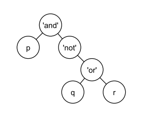

# Árboles Lógicos (P2 C2 2016-02)

Una expresión lógica se puede representar por un árbol binario.

Por ejemplo, la expresión:

$$
p \wedge \neg (q \vee r)
$$

se representa por la figura de más abajo.

Al respecto, se pide escribir la función `evaluar(A)`, que reciba un árbol binario (`AB`) que representa una expresión lógica válida, la evalúe y devuelva su resultado (`True` o `False`).

```python
# p, q y r se pueden reemplazar por True o False
p = True
q = False
r = True

ABlog = AB(
    "and",
    AB(p, arbolVacio, arbolVacio),
    AB(
        "not",
        arbolVacio,
        AB(
            "or",
            AB(q, arbolVacio, arbolVacio),
            AB(r, arbolVacio, arbolVacio)
        )
    )
)
```



**Consideraciones:**

- `p`, `q` y `r` son variables de tipo `bool` (con valores `True` o `False`).
- Los valores de las hojas del árbol son `True` o `False` (de tipo `bool`) y los otros valores son los strings `"and"`, `"or"` o `"not"`.
- En el caso del operador `not`, el operando se guarda en la rama derecha del árbol (y la rama izquierda queda vacía).

**Bonus:**

Escriba una función llamada `expresion(A)`, que reciba un árbol binario como el representado anteriormente y entregue un `string` con la expresión lógica que representa (sin paréntesis).

Por ejemplo:

- `expresion(ABlog)` entrega:

  ```python
  "p and not q or r"
  ```