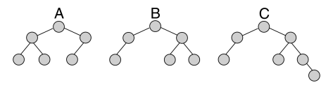

# Árboles k-similares

Dos Árboles Binarios son k-similares si al sobreponer la forma de un árbol binario sobre el otro, existen k o menos nodos que están en un árbol, pero no en el otro. Por ejemplo, considerando los siguientes árboles:



- Los árboles A y B son 2-similares, pues A tiene un nodo que B no tiene, y B tiene un nodo que A no tiene.
- Los árboles B y C son 2-similares, pues C tiene un nodo que B no tiene. También cumplen con ser 1-similares.
- Los árboles A y C NO son 2-similares, ya que A tiene un nodo que C no tiene, y C tiene 2 nodos que A no tiene, por lo que su diferencia de nodos es mayor a 2.
- Los árboles A y B, los árboles B y C, y los árboles A y C cumplen con ser 3-similares.
- Un árbol consigo mismo son 0-similares, ya que son iguales.

Para determinar si dos árboles son k-similares, escriba las siguientes funciones:

Indicación: Para los ejemplos y test, suponga que están definidas las variables A, B, C, con los árboles de arriba, los
cuales están definidos con la siguiente estructura: `estructura.crear("AB", "valor izq der")`

+ **(1.0 p)** Escriba la función ```contarNodos(T)```, que recibe un árbol binario `T`, y retorna el número de nodos (valores) del árbol. Por ejemplo: ```contarNodos(A)``` entrega: ```6```

+ **(4.0 p)** Escriba la función ```diferencia(T1, T2)```, que recibe 2 árboles binarios `T1` y `T2`, y retorna la cantidad de nodos en la que difieren ambos árboles, es decir, cuantos nodos hay en T1 que no están en T2, más la cantidad de nodos que hay en T2, que no están en T1. Por ejemplo: ```diferencia(A,C)``` entrega ```3```

  **Obs:** Puede asumir que la función de la parte (A) ya está disponible.

+ **(1.0 p)** Use las funciones anteriores para escribir la función ```k_similar(T1, T2, k)```, que recibe 2 árboles binarios y un entero `k` (k>=0). La función retorna ```True``` si los árboles T1 y T2 tienen una diferencia de nodos menor o igual a k, y ```False``` en caso contrario. Por ejemplo: ```k_similar(A,C,3)``` entrega ```True```
  
  **Obs:** Puede asumir que las funciones de la parte (A) y (B) ya están disponibles.