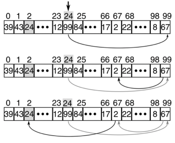

# Casas Halloween 🎃🏠

En Halloween, en un vecindario de 100 casas, los padres han organizado un juego para los niños. Cada casa está numerada del 0 al 99 (`nCasa`) y en su interior se guarda secretamente un número en un papel. En el papel está escrito un número que va del 0 al 99 (`nPapel`) y **es diferente** de la numeración de la casa en la que se encuentra. Los niños no saben en qué casa se encuentra cada número, pero pueden acceder a él si visitan una casa.

El objetivo del juego es que cada niño encuentre el papel con el número de su propia casa, que está oculto en alguna casa del vecindario. Para lograrlo, cada niño primero debe ver el número en el papel guardado en su casa (`nPapel`) y luego visitar la casa cuya numeración coincide con ese número.   

- Si el número en el papel es igual al de la casa en la que vive (`nCasa = nPapel`), el niño ha tenido éxito.
- Si no es así, debe continuar y visitar la casa con la numeración indicada en el papel.

El niño repite este proceso hasta encontrar su casa o haber visitado 50 casas. Si todos los niños encuentran el número de su casa **en hasta 50 intentos**, reciben dulces. Si alguno de ellos no logra encontrar su casa, todos reciben un truco

**Ejemplo:** \
El niño de la casa 24 hace la búsqueda. Parte desde su casa 24. En su casa se guarda el papel con número 99, por lo que debe ir a la casa 99. En la casa 99 le indican que hay que ir a la casa 67. En la casa 67 le señalan que debe ir a la casa 2. Al llegar a la casa 2 se encuentra el papel con el número 24, por lo que encontró el número de su casa exitosamente (en menos de 50 intentos).



**Indicaciones:**
Asuma que no hay ciclos cerrados (es decir, no hay casos del estilo `L[21] = 44` y `L[44] = 21`) por lo que siempre es posible hacer al menos las 50 consultas.


+ **(4.0 p)** Implemente la función ```buscarCasa(casas, nCasa)```. Esta función recibe una lista indexada de tamaño 100 cuyos valores son los números secretos de las casas (valores entre 0 y 99, no repetidos ni ordenados). Además, recibe el número de la casa que hay que buscar en dicha lista (valor entre 0 y 99). Retorna ```True``` si la casa se encontró en hasta 50 intentos y ```False``` si no logró. 

  **Indicación:** Esta función **debe usar** la estrategia presentada en el enunciado. 

+ **(2.0 p)** Implemente la función ```dulceOTruco(casas)```. Esta función recibe una lista indexada de tamaño 100 con los valores los números secretos de las casas (valores entre 0 y 99, no repetidos ni ordenados). Retorna la palabra ```"Dulce"``` si los 100 niños logran encontrar su casa o ```"Truco"``` en caso de que uno de ellos no lo logre.
  
  **Indicación:** Puede hacer uso de la función ```buscarCasa()```, aun si no la ha implementado.
