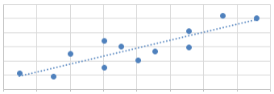
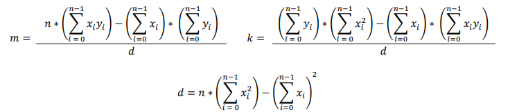

# Recta de Mínimos Cuadrados
Los n puntos de coordenadas $(x_0,x_0)$, $(x_1,y_1)$, … ,$(x_{n-1},y_{n-1})$ pueden ser aproximados por la recta de mínimos cuadrados de ecuación:

$$ f(X) = mX + k $$

Por ejemplo, en la siguiente figura se muestra la recta que aproxima los puntos:



Los valores de la pendiente `m` y la constante `k` se calculan con las siguientes fórmulas: 



Al respecto:

+ **(3.0 p)** Escriba una función (sin test) que calcule la pendiente m y la constante k de acuerdo a la  siguiente receta de diseño:
 
  ```python
  #recta: int list(float) list(float) -> list(float)
  #devuelve lista con 2 valores: la pendiente m y la constante k
  #de la recta de mínimos cuadrados mX+k que aproxima
  #los n puntos de coordenadas (X0,Y0),(X1,Y1), … ,(Xn-1,Yn-1)
  def recta(n,X,Y):
  ```

+ **(3.0 p)** Escriba un programa que lea un archivo (`personas.txt`) con la información de las personas. Cada línea contiene la siguiente información:
  
  - Nombre (20 caracteres). Ejemplo: `"Juan¬Carlos¬Perez¬¬¬"` (se usa “¬” para hacer visible un espacio).
  - Altura en metros (4 caracteres). Ejemplo: `"1.76"`
  - Peso en kilos (siguientes caracteres). Ejemplo: `"74.850"` 
  
  Es decir, la línea tendrá el contenido: `"Juan¬Carlos¬Perez¬¬¬1.7674.850\n"`

  El programa debe grabar el archivo `"nuevo.txt"`, en la misma forma que el archivo `"personas.txt"`, pero con el peso de cada persona calculado de acuerdo a la recta de mínimos cuadrados que se calcula con los valores de las alturas y los pesos de todas las personas.