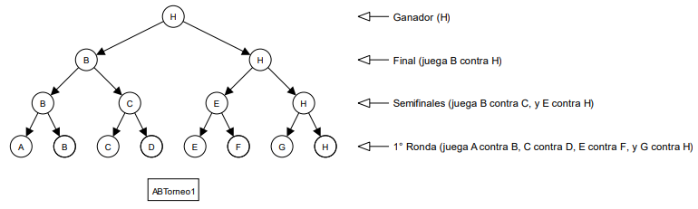
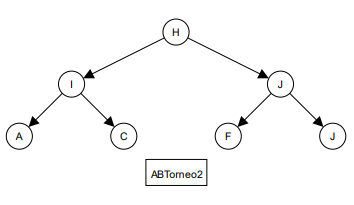

# Campeonato Deportivo ⚽🏆 [C2 2024-2]

Los resultados de un campeonato deportivo por eliminación se representan en un árbol binario (AB) que contiene Strings. Por ejemplo, el árbol binario `ABTorneo1` de la figura representa un campeonato donde el ganador fue **H** (note que **H** jugó contra **G**, **E** y **B**):



El número de rondas del campeonato de un árbol es desconocido. Suponga que todas las rondas están llenas (es decir, se jugaron todos los juegos de todas las rondas).

Note que, en un árbol correcto (como el de arriba), el valor de un nodo siempre corresponde al valor de alguno de sus hijos (el que ganó el juego).

Por otro lado, el árbol binario `ABTorneo2` de la figura de la derecha, no representa un árbol de torneo válido, pues no se cumple lo anterior (ninguno de los hijos del nodo H, tienen su mismo valor)



Considerando la siguiente definición de árbol binario:

```python
# AB: valor(str) izq(AB) der(AB)
estructura.crear('AB', 'valor izq der')
```

Y suponiendo que existen las variables `ABTorneo1` y `ABTorneo2`, que definen los árboles de ejemplo de arriba, escriba las siguientes funciones:

+ Escriba la función `validar(A)`, que recibe un árbol binario, y entrega ```True``` si se encuentra construido correctamente, representando un torneo válido (y ```False``` en cualquier otro caso). Ejemplos:
  - ```validar(ABTorneo1)``` entrega: ```True```
  - ```validar(ABTorneo2)``` entrega: ```False```

+  Escriba la función ```rivales(A)```, que recibe un árbol binario que representa un torneo, y entrega una lista con todos los rivales que fueron derrotados por el ganador del torneo. Ejemplo:
   - ```rivales(ABTorneo1)``` entrega: ```lista('B', lista('E', lista('G', listaVacia)))```

    Nota: El orden de los rivales en la lista no es importante. Puede entregarlos en el orden que estime conveniente dentro de la lista.