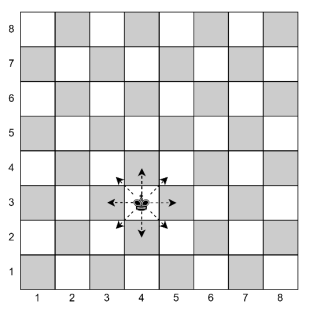

# Ajedrez ♟️

En el juego del Ajedrez, la pieza del rey se puede mover en todas las direcciones, pero solo de a un casillero a la vez. Al respecto, existe la clase `Rey`, que permite mover un rey dentro de un tablero de ajedrez de 8x8.

| Método | Efecto | Ejemplo |
|---|---|---|
| ```R = Rey(x, y)``` | En un tablero de ajedrez de 8×8, crea un rey en las coordenadas indicadas. | ```R = Rey(4, 3)``` |
| ```R.mover(x, y)``` | Mueve al rey a las coordenadas indicadas, siempre que solo tenga que moverse un casillero respecto de su posición actual y que no se salga del tablero. | ```R.mover(5, 3)``` |
| ```R.posicion()``` | Entrega una lista con los valores ```x``` e ```y``` de la posición actual del rey. | ```R.posicion()``` entrega ```[5, 3]```. |

Consideraciones:

- Al momento de crear un objeto de la clase `Rey`, si se intenta crear
en coordenadas no válidas, entonces lo creará en las coordenadas
(1,1).
- El rey no puede moverse fuera del tablero. Si lo intenta, entonces
no se moverá.
- El rey sólo puede moverse de a un casillero a la vez. Si intenta
moverse más de dos casillas en un solo movimiento, entonces no
se moverá.

  

Al respecto:

+ **(3.0 p)** Escriba un programa que cree un objeto de la clase `Rey` en las coordenadas (1,1). Luego, el rey tiene que moverse en el tablero, siguiendo la trayectoria mostrada en la imagen de la derecha, es decir, debe pasar por el borde inferior, la diagonal principal y el borde superior del tablero. Además, debe mostrar en pantalla la posición del rey cada vez que se encuentre en una esquina del tablero.

  .PNG)

+ **(3.0 p)** Escriba el método `mover` de la clase `Rey`. Considere que la representación de un objeto de la clase `Rey` se define con dos atributos (variables de instancia) de tipo entero, que representan su posición en `x` e `y` respectivamente. No incluya testing.

  ```python
  self.__x
  self.__y
  ```