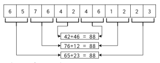

# Números Sumeru

Los números de Sumeru son los que cumplen la siguiente propiedad:

- Su cantidad de dígitos es múltiplo de 4.
- Si se toma el primer par de dígitos del número, y se suma con el último par, tiene que dar la misma suma que al segundo par de dígitos del número sumarle el penúltimo par de dígitos, y así sucesivamente. Lo cual se puede ver en el diagrama de la derecha.
- Todos los números con exactamente 4 dígitos por definición se consideran números de Sumeru.

  

Para esta pregunta puede asumir como conocida la función ```digitos(N)```, que permite contar la cantidad de dígitos que tiene un número entero positivo.

- ```digitos(5421)``` entrega ```4```.
- ```digitos(9)``` entrega ```1```.

+ **(3 ptos.)** Escriba la función ```sumarExtremos(N)```, que recibe un número entero positivo con una cantidad de dígitos mayor o igual a 4, y entrega la suma de los pares de dígitos en sus extremos. Ejemplos:
  - ```sumarExtremos(75412698)``` entrega ```173``` (que corresponde a sumar 75 + 98).
  - ```sumarExtremos(12453164)``` entrega ```76``` (que corresponde a sumar 12 + 64).
  - ```sumarExtremos(5642)``` entrega ```98``` (que corresponde a sumar 56 + 42).
  - ```sumarExtremos(657642461223)``` entrega ```88``` (que corresponde a sumar 65 + 23).

+ **(3 ptos.)** Escriba la función recursiva ```comprobar(N)```, que recibe un número entero positivo cuya cantidad de dígitos es múltiplo de 4, y verifica que se cumpla la propiedad de los números de Sumeru. Ejemplos:
  - ```comprobar(75412698)``` entrega ```False``` (ya que 75 + 98 != 41 + 26).
  - ```comprobar(12453164)``` entrega ```True``` (ya que 12 + 64 == 45 + 31).
  - ```comprobar(5642)``` entrega ```True``` (por definición).
  - ```comprobar(657642461223)``` entrega ```True``` (ya que 65 + 23 == 76 + 12 == 42 + 46).