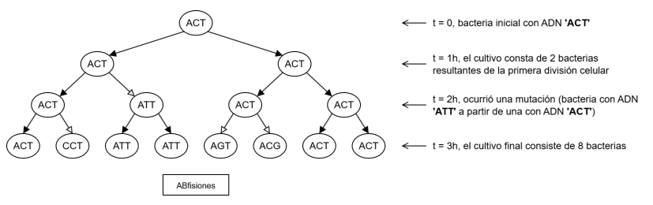

# Bacterias de Choufeb


Las **bacterias de Choufeb** son microorganismos que realizan su proceso de división celular cada **1 hora**. Haciendo uso de un árbol binario (AB), se puede estudiar el crecimiento de un cultivo bacteriano a lo largo del tiempo, originado a partir de una bacteria de Choufeb inicial.

En este árbol, cada nodo contiene el ADN de una bacteria representado como un **string**. Cuando una bacteria se divide, se crean siempre **dos nodos hijos**, con el mismo ADN del padre, **excepto cuando ocurre una MUTACIÓN** (cambia su ADN) durante la división. Un ejemplo de esto es el AB `ABfisiones`:



Las flechas en blanco indican **instancias de mutación**, en las que el ADN de una bacteria no se replicó correctamente (el valor de un nodo es distinto al de uno de sus hijos).

Considere la siguiente definición de árbol binario:

```python
# AB: valor(str) izq(AB) der(AB)
estructura.crear('AB', 'valor izq der')
```

Para los ejemplos de las funciones, suponga que existe la variable ABfisiones con el árbol de la figura. Se le pide escribir las siguientes funciones:

+ **(3.0p)** Escriba la función recursiva ```mutaciones(A)```, que recibe un **AB con ADNs de bacterias**, y entrega la **cantidad de instancias de mutación** ocurridas en total (en la figura, corresponde a la cantidad de flechas en blanco). Ejemplo: 
  - ```mutaciones(ABfisiones)``` entrega: ```4```
  
+ **(3.0p)** Escriba la función recursiva ```cultivo(A, t)```, que recibe un **AB con ADNs de bacterias** y un número entero de horas. La función entrega una lista con los ADNs de las bacterias en el cultivo, luego de que haya transcurrido el tiempo indicado. Ejemplos:
  - ```cultivo(ABfisiones, 0)``` entrega: ```lista('ACT', listaVacia)```
  - ```cultivo(ABfisiones, 2)``` entrega: ```lista('ACT', lista('ATT', lista('ACT', lista('ACT', listaVacia))))```
  - ```cultivo(ABfisiones, 3)``` entrega: ```lista('ACT', lista('CCT', lista('ATT', lista('ATT', lista('AGT', lista('ACG', lista('ACT', lista('ACT', listaVacia))))))))```

**Indicaciones:**
- Como indica el enunciado, puede asumir que los nodos internos de los AB de entrada tendrán siempre 2 hijos.
- Para la parte **(B)**, puede usar la función ```concatenar(L1, L2)```, que entrega una nueva lista con todos los valores de la lista **L1** y a continuación todos los valores de la lista **L2**.
- Para la parte **(B)**, puede asumir que `t` nunca será mayor al tiempo de vida del cultivo, y puede omitir el caso base cuando `A` es vacío.