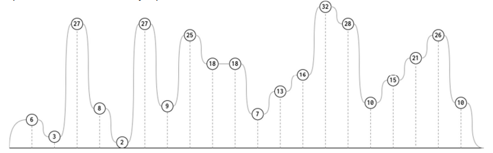

# Montaña Rusa 🎢 [C3 2025-2]

Una montaña rusa se puede modelar como una lista de Python, en donde se almacenan las alturas con respecto al suelo de distintos puntos de tal montaña. Por ejemplo:



`LM = [ 6, 3, 27, 8, 2, 27, 9, 25, 18, 18, 7, 13, 16, 32, 28, 10, 15, 21, 26, 10 ]`

Para determinar qué tan emocionante será una montaña rusa, se define el concepto de **zonas de potencial**, que corresponde a el o los segmentos donde la altura no disminuye. Por ejemplo, para la montaña anterior, estas zonas serían:

`[6]`, `[3, 27]`, `[8]`, `[2, 27]`, `[9, 25]`, `[18, 18]`, `[7, 13, 16, 32]`, `[28]`, `[10, 15, 21, 26]`, `[10]`

Es decir, hay 10 zonas no decrecientes en altura, y las zonas más largas son: `[7, 13, 16, 32]` y `[10, 15, 21, 26]`.

Al respecto, escriba las siguientes funciones:

+ **(2.0p)** ```numeroZonas(L)``` (sin receta de diseño, sólo el cuerpo de la función), que recibe una lista de Python con las alturas de una montaña rusa (toda montaña rusa Ɵene al menos una altura), y devuelve la canƟdad de zonas de potencial. 

  Ejemplo: ```numeroZonas(LM)``` entrega: ```10```

+ **(3.0p)** ```encontrarZonas(L)``` (con receta de diseño completa), que recibe una lista de Python con las alturas de una montaña rusa, y entrega una lista de listas que contenga todas las zonas de potencial. 
  
  Ejemplo: ```encontrarZonas(LM)``` entrega ```[ [6], [3, 27], [8], [2, 27], [9, 25], [18, 18], [7, 13, 16, 32], [28], [10, 15, 21, 26], [10] ]```

+ **(1.0p)** ```zonaMasLarga(L)``` (sin receta de diseño, sólo el cuerpo de la función), que recibe una lista de Python con las alturas de una montaña rusa, y devuelve una lista con la zona de potencial más larga. En caso de empate en el largo máximo entre dos o más zonas, debe devolver la lista con la primera zona encontrada con dicho largo. 
  
  Ejemplo: ```zonaMasLarga(LM)``` entrega: ```[7, 13, 16, 32]```
