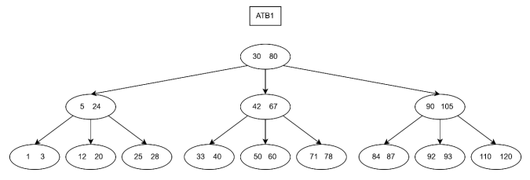

# Árboles Ternarios [Ex 2025-2]

Se define un Árbol Ternario (árbol con tres hijos) usando la siguiente estructura:

```python
# AT: x(int) y(int) izq(AT) medio(AT) der(AT)
estructura.crear('AT', 'x y izq medio der') 
```

Un Árbol Ternario de Búsqueda (ATB) es un Árbol Ternario que cumple con las siguientes propiedades:
- La raíz del ATB contiene dos valores enteros (x e y).
- Las ramas izquierda, medio, y derecha de la raíz son ATBs.
- Los valores de la rama izquierda del ATB son todos menores que el valor x de la raíz.
- Los valores de la rama derecha del ATB son todos mayores que el valor y de la raíz.
- Los valores de la rama del medio del ATB son todos mayores que x y menores que y.
- No hay valores repetidos en el ATB.

Por ejemplo, el siguiente árbol `ATB1` es un ATB:



Escriba la función ```buscar(ATB, valor)```, que recibe la raíz de un ATB y un valor entero, y devuelve el AT que contenga a ```valor```, o devuelve ```None``` si no está en el ATB. Note que valor puede corresponder a x o y en el AT. 

Por ejemplo:

- ```buscar(ATB1, 67)``` entrega: 
  
  ```python
    AT(42, 67,
      AT(33, 40, None, None, None),
      AT(50, 60, None, None, None),
      AT(71, 78, None, None, None))
  ```
- ```buscar(ATB1, 25)``` entrega: ```AT(25, 28, None, None, None)```
- ```buscar(ATB1, 52)``` entrega: ```None```