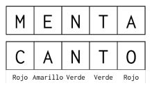

# Wordle [Ex 2025-2]

En el juego de "Wordle" (o adivina la palabra del día), una persona tiene que adivinar una palabra secreta. Para ello, el jugador que adivina proponer una palabra, donde el oponente realiza una comparación con la palabra secreta, indicando letra por letra:

- Rojo cuando la letra no pertenece a la palabra secreta.
- Amarillo cuando la letra pertenece a la palabra secreta, pero no en esa posición.
- Verde cuando la letra pertenece a la palabra secreta en esa posición exacta.

Por ejemplo, si la palabra secreta es 'MENTA', y se ingresa 'CANTO':
- C no está en la palabra secreta (Rojo)
- A está en la palabra secreta, pero en otra posición (Amarillo).
- N y T están en esas posiciones (Verde).
- O no está en la palabra secreta (Rojo).

  

En esta pregunta, implementaremos una variante de este juego, con las siguientes consideraciones:
- La palabra secreta tendrá un largo arbitrario mayor o igual a 1.
- La palabra secreta no tendrá letras repetidas.
- Hay ilimitados intentos para adivinar la palabra secreta.

1. **(3.0p)** Escriba la función ```comparar(Psecreta, Ppropuesta)```, la que recibe dos Strings, el primero con la palabra secreta y el segundo con la palabra propuesta. La función retorna una lista de Python con los resultados de la comparación. Cada elemento de la lista contiene la letra inicial de cada color ('R', 'A', 'V’), de acuerdo con las reglas anteriores. Asuma que ambos Strings siempre tendrán el mismo largo, mayor o igual a 1, pero desconocido. 
   
    Por ejemplo:
    
    - ```comparar('MENTA', 'CANTO')``` entrega: ```['R', 'A', 'V', 'V', 'R']```
    - ```comparar('MENTA', 'MENTA')``` entrega: ```['V', 'V', 'V', 'V', 'V']```
    - ```comparar('MAGNITUD', 'SUBLIMAR')``` entrega: ```['R', 'A', 'R', 'R', 'V', 'A', 'A', 'R']```
  
2. **(3.0p)** Escriba un programa interactivo, que permita simular el siguiente dialogo del juego:

    ```python
    ingrese dificultad: 5

    >>> ingrese palabra: CANTO
    Resultado: R-A-V-V-R

    >>> ingrese palabra: MONTE
    Resultado: V-R-V-V-A

    ... (luego de varios intentos más) ...

    >>> ingrese palabra: MENTA
    Has adivinado la palabra secreta en 6 intentos
    ```

    Indicaciones:
    - Las líneas marcadas con `>>>` es donde se espera que una persona ingrese un dato.
    - La dificultad corresponde al largo de la palabra secreta, un número entero mayor o igual a 1.
    - Debe repetir el ciclo de interacción hasta que se adivine la palabra secreta.
    - Debe contar la cantidad de intentos y mostrarlos en pantalla una vez adivinada la palabra secreta.
    - Puede suponer la existencia de la función `generarPalabra(N)`, que retorna una palabra de largo N sin letras repetidas. Úsela para generar la palabra secreta inicial.