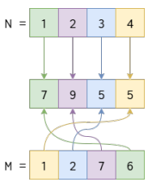

# Sumar números

Programe una función ```sumar(n, m)``` que recibe 2 números enteros positivos: `n` y `m`. Ambos números tienen siempre el mismo largo, pero dicho largo es variable. El objetivo de la función es sumar uno a uno los dígitos entre ambos números pero no en orden lineal, sino que, los dígitos de izquierda a derecha en `n`, se van sumando con los dígitos de derecha a izquierda en `m`.

Dicho de otra forma:
- el primer dígito de `n` se suma con el último de `m`, el resultado de esta suma se posiciona en el primer dígito del resultado.
- luego el 2do dígito de `n` se suma con el penúltimo de `m`. Este resultado se posiciona en el 2do dígito del resultado.
- Así sucesivamente… como se muestra en el siguiente diagrama:

  

Puede asumir que nunca recibirá números `n` y `m` tal que al hacer la suma correspondiente, esta de como resultado un número mayor que 9.

Por ejemplo:

```python
n = 1234
m = 1276
```

Entonces, ```sumar(n, m)``` entregará ```7955```, correspondiente a:

- 1 + 6 = 7
- 2 + 7 = 9
- 3 + 2 = 5
- 4 + 1 = 5

Más ejemplos:

- ```sumar(21, 45)``` entrega ```75```
- ```sumar(111111, 123456)``` entrega ```765432```

**Importante:** No utilice la función ```invertir()```, cree una buena recursión para recorrer un número de izquierda a derecha.