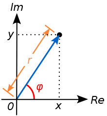

# Números complejos

Un número complejo $z$ se define de la forma $z = a + bi$, con $a,b \in \mathbb{R}$. Llamamos **parte real** del complejo $z$ a $a$, y **parte imaginaria** a $b$.



Se le pide que, por medio de estructuras, implemente el **Módulo Complejo** y las siguientes operaciones:

- La estructura `Complejo`, la cual posee dos atributos: `real` e `img`.

- La función `esComplejo(X)`, que retorna `True` si el parámetro entregado corresponde efectivamente a un `Complejo` válido, y `False` en cualquier otro caso.

  **Ejemplos:**
  ```python
  esComplejo("dulces")
  # False
  ```

  ```python
  esComplejo(Complejo(1, 2))
  # True
  ```

- La función `cartToStr(Z)`: recibe un `Complejo` y retorna un `string` de la forma `a + bi` (forma cartesiana).

  **Ejemplo:**
  ```python
  cartToStr(Complejo(1, 2))
  # "1 + 2i"
  ```

- La función `suma(Z1, Z2)`: recibe dos `Complejo` y retorna un `Complejo` correspondiente a la suma de ambos (forma cartesiana).

  **Ejemplo:**
  ```python
  suma(Complejo(1, 2), Complejo(3, 4))
  # Complejo(4, 6)
  ```

- La función `mult(Z1, Z2)`: recibe dos `Complejo` y retorna un `Complejo` correspondiente a la multiplicación de ambos (forma cartesiana).

  **Ejemplo:**
  ```python
  mult(Complejo(1, 2), Complejo(3, 4))
  # Complejo(-5, 10)
  ```

  **Indicación:**

  $$
  (a + bi)(c + di) = (ac - bd) + (ad + bc)i
  $$

- La función `modulo(Z)`: recibe un `Complejo` y retorna un `float` correspondiente a su módulo.

  **Ejemplo:**
  ```python
  modulo(Complejo(1, 2))
  # ≈ 2.236
  ```

- La función `phi(Z)`: recibe un `Complejo` y retorna un `float` correspondiente al ángulo que forma el complejo con el eje real.

  **Ejemplo:**
  ```python
  phi(Complejo(1, 2))
  # ≈ 1.107
  ```

- La función `polarToStr(Z)`: recibe un `Complejo` y retorna un `string` de la forma `r * exp(i * phi)` (forma polar).

  **Ejemplo:**
  ```python
  polarToStr(Complejo(1, 2))
  # "2.236 exp(i*1.107)"
  ```