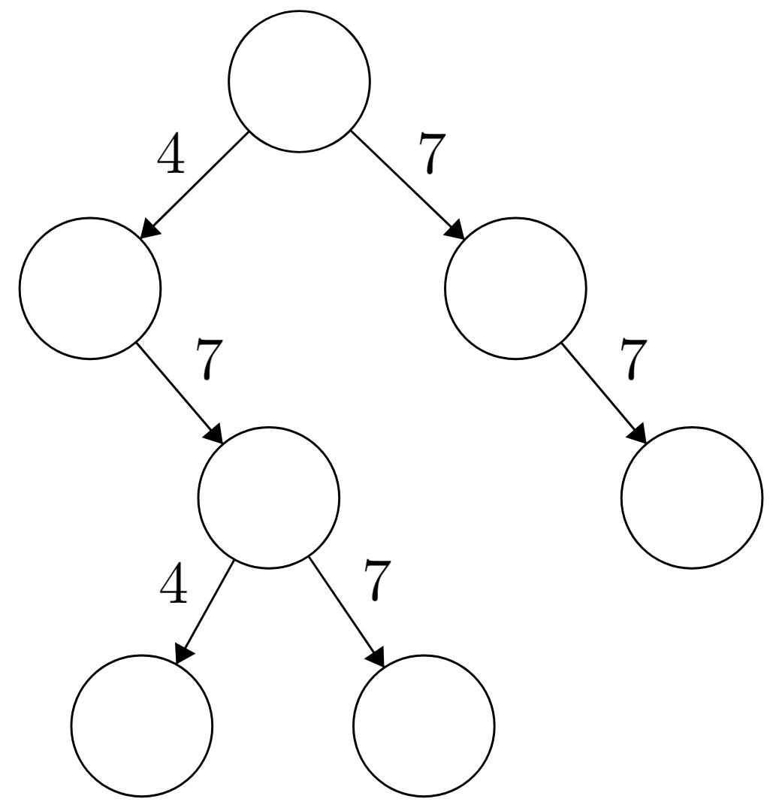

# Árbol de claves 🔒🔑

En la casa de su mejor amigo(a) hay un refrigerador con una inmensurable cantidad de helado, pero está protegido por un sistema de contraseñas. Cada persona en la familia posee una clave particular, y para abrir el refrigerador se requieren 3 claves distintas (lo que quiere decir que al menos 3 personas quieren comer helado, y así se evita que alguien decida comerse todas las reservas de helado). En más de una ocasión han deseado comer helado para ver películas en Netflix, pero no hay suficiente gente en la casa para abrir el refrigerador, por lo que se proponen **hackear** el sistema.

Revisando en internet, descubren que el sistema de claves aceptadas por el refrigerador se representa a través de un árbol binario, y que las claves aceptadas por el refrigerador se componen como una secuencia de `4` y/o `7`, en la cual cada **rama** es una cifra de la contraseña (`4` o `7`), y una contraseña es aceptada si se llega a una hoja del árbol. Por ejemplo, en el árbol:



Las claves aceptadas son `77`, `477` y `474` (ya que son recorridos del árbol que terminan en una hoja). Además, note que irse por la rama derecha aporta un `4` a la clave, mientras que irse por la rama izquierda aporta un `7`.

Como usted se cree *hackerman/hackerwoman*, debido a que está dando un curso de programación, creará la función `verificar(AC, Lclave)` que recibe un árbol binario de contraseñas y una lista, donde cada elemento es una cifra de la clave a probar. Entrega `True` si la clave ingresada es aceptada por el árbol (es decir, llega a una hoja de este), o `False` en caso contrario.

Ejemplos:

```python
clave1 = lista(4, lista(4, lista(7, listaVacia)))  # representa 447
clave2 = lista(4, lista(7, lista(7, listaVacia)))  # representa 477

verificar(arbolClaves, clave1)  # False
verificar(arbolClaves, clave2)  # True
```