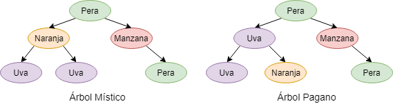

# Árbol Místico

En el antiguo reino de _bochef_, existía un árbol místico, que producía una diversidad de frutos, los cuales al ser consumidos, permitían obtener conocimiento y confidencia para aprobar todos los controles. El Concilio de la Torre Perimetral (CTP) decidió ocultar este árbol místico, entre otros arboles paganos de similares características, pero que el consumo de sus frutos solo traía dudas y desesperación. 

Hasta el día de hoy se desconoce cual es el árbol místico, y la única pista es una inscripción dejada por le CTP que dice "Si observamos todos los arboles como arboles binarios, el árbol místico es tal que cumple que no tiene dos frutos iguales unidos entre sí". Es decir, un nodo no puede tener como hijos(as) a nodos idénticos a el.



Para encontrar una nueva dirección y sentido al vector de su vida, cree la función ```verificar(A)```, que recibe un árbol binario de frutas, y se encargará de revisar si cumple o no tal mística propiedad.