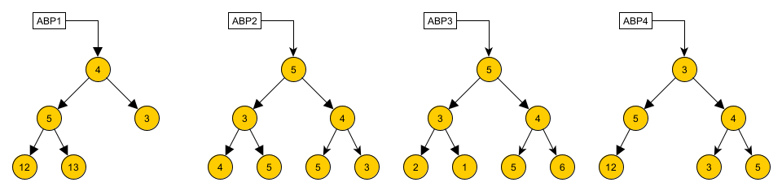

# Árboles Pitagóricos

Un árbol binario de números se dice que es **pitagórico** si cumple, para todos sus nodos que no son hojas, que el valor del nodo, junto a los valores de sus ramas izquierda y derecha, cumplen la relación:

$$
a^2 + b^2 = c^2
$$

Por ejemplo, los árboles `ABP1` y `ABP2` cumplen con ser árboles pitagóricos, pero `ABP3` y `ABP4` no (no cumple la relación para todos sus nodos, y no tiene la forma correcta, respectivamente).

Además, por simplicidad, un árbol con un solo nodo y un árbol vacío diremos que cumplen con ser pitagóricos.

Para esta pregunta puede suponer:

- Existe la función `pitagoras(x, y, z)`, que entrega `True` si alguna combinación de los 3 valores ingresados cumple la relación de Pitágoras, y `False` si no.
- Existen las variables `ABP1`, `ABP2`, `ABP3` y `ABP4` que definen los árboles de ejemplo anteriores.

Al respecto, realice lo siguiente:

- Cree la función `esPitagorico(A)`, que recibe un árbol binario de números, y valida que cumpla con ser un árbol pitagórico.

- Cree la función `contarTriangulos(A)`, que recibe un árbol binario que cumple con ser pitagórico, y entrega la cantidad de tríadas (valor-izq-der) de nodos que tiene el árbol.

  Ejemplos:

  - `contarTriangulos(ABP1)` entrega `2`.
  - `contarTriangulos(ABP2)` entrega `3`.