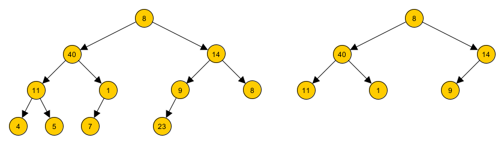

# Podando un árbol ✂️🌳

Para un árbol binario cualquiera, se dice que se quiere realizar una operación de **podado** cuando se quieren recortar (eliminar) todas sus hojas.



Por ejemplo, en la imagen anterior, se puede ver un árbol de números (que llamaremos `Anumeros`), y luego el mismo árbol luego de la operación de poda, en la que se eliminaron todas sus hojas.

Al respecto, se pide lo siguiente:

- Cree la función `podarArbol(A)`, que recibe un árbol binario, y entrega ese árbol binario, pero con sus hojas eliminadas. Por ejemplo:

  ```python
  podarArbol(Anumeros) entrega:

  AB(8,
     AB(40,
        AB(11, arbolVacio, arbolVacio),
        AB(1, arbolVacio, arbolVacio)),
     AB(14,
        AB(9, arbolVacio, arbolVacio),
        arbolVacio))
  ```

- Cree la función `contarPodas(A)`, que recibe un árbol binario, y entrega la cantidad de podas requeridas para que el árbol sea eliminado completamente.

  Por ejemplo:

  - `contarPodas(Anumeros)` entrega `4`.