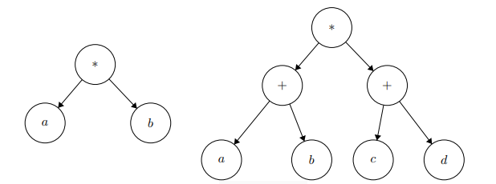

# Árbol Expresiones Matemáticas

Podemos expresar una expresión matemática con arboles binarios. Por ejemplo las expresiones:
 - $a \cdot b$
 - $(a + c) \cdot (b + d)$
 
corresponderían a los siguientes arboles binarios:



Por lo tanto, programe la función ```expresion(A)``` que dado un árbol binario `A` que representa una expresión matemática, retorne un string con la expresión que representa.

**Indicaciones:**
- Suponga que siempre `A` contiene una expresión.
- Note que las letras siempre están en la hoja de los arboles.

