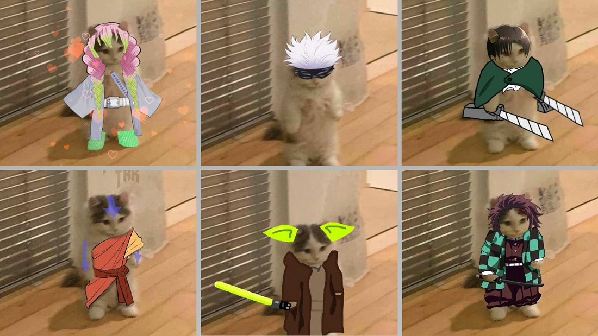

# Michigatitos 🐈⚔️

En una nueva iniciativa para aumentar la procastinación en las semanas previas a los exámenes, ha aparecido un nuevo juego conocido como `Michigatitos`

Estos gatitos coleccionables, personalizables y entrenables, tienen distintas características, vida y poderes, y pueden combatir entre si.



Al respecto, a usted y su grupo de amiwis, le interesa crear una versión simplificada de estos Michigatitos, usando sus conocimientos de Programación de Objetos en Python, para lo cual, se proponen a implementar la clase `Michigatitos`, con las siguientes consideraciones:

- Un Michigatito almacena su `nombre`, `vida actual`, `vida total` y `poder de ataque`
- Se necesita un método que permita obtener la vida actual
- Se necesita un método que permita restaurar toda la vida
- Se necesita un método que permita que dos Michigatitos puedan interactuar/atacarse entre si

Al respecto:

+ Cree la clase ```Michigatitos``` y su método constructor.

  Suponga que un Michigatito se representa con un nombre y 3 números *enteros* positivos:
  - ``` self.__nombre```: nombre del Michigatito
  - ``` self.__vidaAct```: vida actual
  - ``` self.__vidaTotal```: vida total
  - ``` self.__ataque```: poder de ataque
  
  El constructor:
  - Recibe el nombre, la vida total y el poder de ataque
  - Debe validar que ambos números sean enteros positivos
  - _Setea_ inicialmente la vida actual como la vida total
  
  Ejemplo:
  - ```levi = Michigatitos("Levi", 50,20)```, crea un Michigatito con 50 de vida y 20 de ataque.
  - ```mitsuri = Michigatitos("Mitsuri", 80,30)```, crea una Michigatita con 80 de vida y 30 de ataque

+ Implemente el método ```getVidaAct(self)```, que entrega la vida actual de un Michigatito(a).

  Ejemplo: ```levi.getVidaAct()``` entrega ```50```

+ Implemente el método ```regenerar(self)```, que no recibe ni entrega parámetros, pero _setea_ su vida actual con el valor de su vida total

  Ejemplo: ```mitsuri.regenerar()```, deja su vida actual en ```80```, sin importar su valor previo.

+ Implemente el método ```atacar(self, G2)```, que hace que dos Michigatitos se ataquen entre sí. No entrega un resultado, pero modifica la cantidad de vida actual de cada Michigatito de la siguiente manera:

  - El Michigatito 1 pierde vida equivalente a la cantidad de ataque de Michigatito 2
  - El Michigatito 2 pierde vida equivalente a la cantidad de ataque de Michigatito 1
  
  Por ejemplo, si tenemos:
  
  ```python
  levi = Michigatitos("Levi", 50,20)
  mitsuri = Michigatitos("Mitsuri", 80,30)
  ```
  
  Entonces ```levi.atacar(mitsuri)``` deja a ```levi``` con ```20``` de vida y a ```mitsuri``` con ```60``` de vida.
  
  Notas:
  - Dos Michigatitos solo pueden atacarse si ambos tienen vida actual positiva. Si uno o ambos no cumplen esto, entonces atacar no modifica nada.
